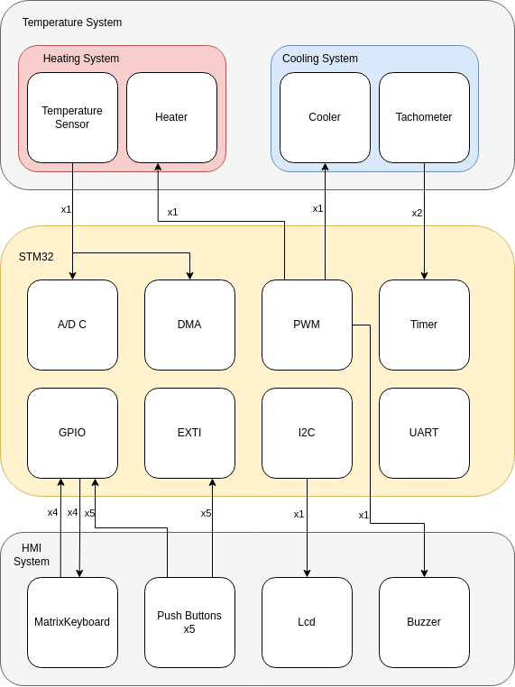
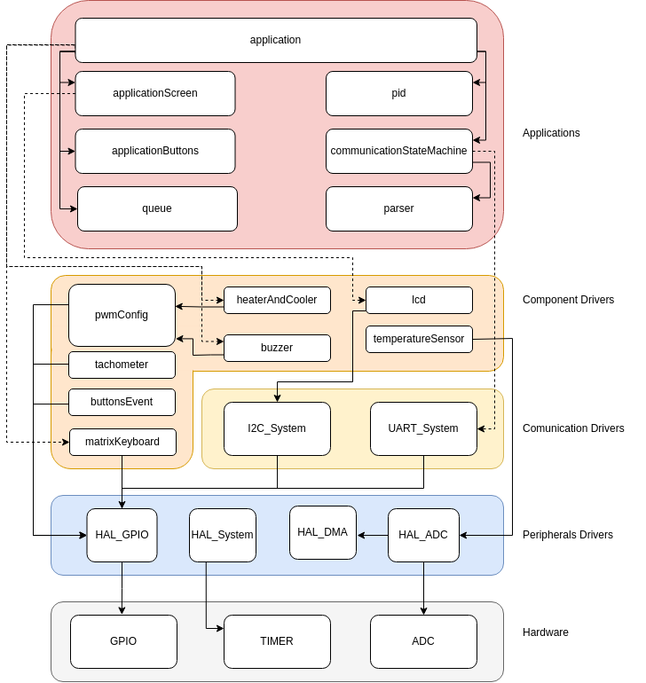
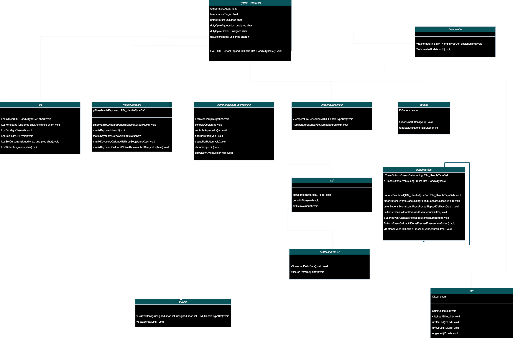

# ES670-2024-GrupoB3

## Project Overview

O projeto é composto por um sistema embarcado de tempo real para o controle de temperatura de um aquecedor. O sistema irá contar com diferentes formas de interação Homem / Máquina, além de 
diferentes protocolos de comunicação (UART, i2C, entre outros). 

A documentação preliminar do sistema pode ser encontrado no no diretório `Docs`. É importante ressaltar que os requisitos e arquitetura levantados até o momento não estão congelados 
(baseline de requisitos não fechada) e conforme o andamento do desenvolvimento e exploração dos diferentes periféricos e componentes eles serão alterados.

## Modelagem do Sistema

De forma geral, os sistemas e subsistemas que irão compor o projeto são representados pelo diagrama de blocos abaixo:

Expandindo para o nível de arquitetura de software, temos a seguinte organização:

Aprofundando mais no quesito software e a relação de dependência entre cada módulo temos:

## Requisitos

A coisa mais importante de ressaltar é que qualquer implementação e escolha feita durante o desenvolvimento do software deve visar a adequação e o cumprimento dos requisitos 
(desde os requisitos oriundos dos stakeholders needs até os requisitos de baixo nível derivados durante o desenvolvimento). 

| *1. Temp System*         |                                                                                                                                                         |                                                                                                                             |                      |
|------------------------|---------------------------------------------------------------------------------------------------------------------------------------------------------|-----------------------------------------------------------------------------------------------------------------------------|----------------------|
| *1.1 Heat System*        |                                                                                                                                                         |                                                                                                                             |                      |
| **ReqID**                  | **Requirement Description**                                                                                                                                 | **Rationale**                                                                                                                   | **Related Requirements** |
| HEAT001                | O sistema de aquecimento deverá ser capaz de capturar a temperatura [REAL_TEMP] do aquecedor                                                            | -                                                                                                                           | -                    |
| HEAT002                | O sistema de aquecimento deverá manter a temperatura do aquecedro a um valor [TEMP_TARGET]                                                              | -                                                                                                                           | -                    |
| HEAT003                | O valor [TEMP_TARGET] não deve assumir valores maiores que 90° C                                                                                        | Considerando que estamos lidando com um componente montado em uma PCB, altas temperaturas podem danificar sistemas próximos | HEAT007              |
| HEAT004                | O sistema de aquecimento não deverá demorar mais que 5s para atingir o valor [TEMP_TARGET]                                                              | -                                                                                                                           | -                    |
| HEAT005                | O sistema de aquecimento não deverá ultrapassaro valor de [TEMP_TARGET] por mais de 1°C                                                                 | -                                                                                                                           | -                    |
| HEAT006                | O sistema de aquecimento deverá ser controlado através de um PWM                                                                                        | -                                                                                                                           | -                    |
| HEAT007                | O valor [REAL_TEMP] não deve assumir valores maiores que 90° C                                                                                          | Considerando que estamos lidando com um componente montado em uma PCB, altas temperaturas podem danificar sistemas próximos | HEAT003              |
| HEAT008                | O valor [REAL_TEMP] deverá ser representado por um sinal analógico linear com fator de 10 mV/°C                                                         | Sinal de saída do sensor de temperatura, requisito de interface                                                             |                      |
|                        |                                                                                                                                                         |                                                                                                                             |                      |
| *1.2 Cooling System*     |                                                                                                                                                         |                                                                                                                             |                      |
| **ReqID**                  | **Requirement Description**                                                                                                                                 | **Rationale**                                                                                                                   | **Related Requirements** |
| COOL001                | O sistema de resfriamento deverá ser capaz de capturar a valocidade real de rotação [REAL_FAN_SPEED] do Cooler de resfriamento                          | -                                                                                                                           | -                    |
| COOL002                | O sistema de resfriamento deverá ser capaz de controlar a velocidade de rotação [REAL_FAN_SPEED] do Cooler de resfriamento através de um sinal PWM      | -                                                                                                                           | -                    |
| COOL003                | O sistema de resfriamento deverá manter [REAL_FAN_SPEED] com um erro de regime permanente em relação a [TARGET_FAN_SPEED] menor que 10%                 | -                                                                                                                           | -                    |
| COOL004                | O valor [REAL_FAN_SPEED] não  deverá assumir valores acima de 4500RPM                                                                                   | Limitação física do cooler                                                                                                  | -                    |
| COOL005                |                                                                                                                                                         |                                                                                                                             |                      |
|                        |                                                                                                                                                         |                                                                                                                             |                      |
|                        |                                                                                                                                                         |                                                                                                                             |                      |
| *2. HMI System*          |                                                                                                                                                         |                                                                                                                             |                      |
| **ReqID**                  | **Requirement Description**                                                                                                                                 | **Rationale**                                                                                                                   | **Related Requirements** |
| HMI001                 | O sistema deverá fornecer uma interface local para operação                                                                                             | -                                                                                                                           |                      |
| HMI002                 | O sistema deverá ser capaz de mostrar [REAL_TEMP] no Display LCD                                                                                        | -                                                                                                                           |                      |
| HMI003                 | O sistema deverá atualizar o valor [REAL_TEMP], quando em amostra no display LCD, a uma taxa de 2Hz                                                     | -                                                                                                                           |                      |
| HMI004                 | O sistema deverá ser capaz de mostrar [REAL_FAN_SPEED] no Display LCD                                                                                   | -                                                                                                                           |                      |
| HMI005                 | O sistema deverá atualizar o valor [REAL_FAN_SPEED], quando em amostra no display LCD, a uma taxa de 2Hz                                                | -                                                                                                                           |                      |
| HMI006                 | O sistema deverá ser capaz de ler [KEYBOARD_INPUT] de um teclado matricial                                                                              | -                                                                                                                           |                      |
| HMI007                 | O sistema deverá ser capaz de identificar o pressionamento de botões embarcados [UP_BTN, DOWN_BTN, LEFT_BTN, RIGHT_BTN, MIDDLE_BTN]                     | -                                                                                                                           |                      |
| HMI008                 | O sistema deverá ser capaz de avisar de maneira sonora o usuário                                                                                        | -                                                                                                                           |                      |
| HMI009                 | O sistema sonoro deve estar na faixa de frequência de 100 e 10000Hz                                                                                     | -                                                                                                                           |                      |
| HMI010                 | O sistema sonoro deve ser capaz de ser acionado em um intervalo de tempo de 1 a 10000ms                                                                 | -                                                                                                                           |                      |
| HMI011                 | O sistema sonoro deve ser acionado através de um sinal PWM                                                                                              | -                                                                                                                           |                      |
| HMI012                 | O sistema deverá ser capaz de utilizar LEDs [LED_GREEN, LED_BLUE, LED_RED] a fim de transmitir status de operação                                       | -                                                                                                                           |                      |
| HMI013                 | O sistema de LEDs [LED_GREEN, LED_BLUE, LED_RED] deve ser acionado através de um sinal PWM                                                              | -                                                                                                                           |                      |
| HMI014                 |                                                                                                                                                         |                                                                                                                             |                      |
|                        |                                                                                                                                                         |                                                                                                                             |                      |
|                        |                                                                                                                                                         |                                                                                                                             |                      |
| *3. Comunication System* |                                                                                                                                                         |                                                                                                                             |                      |
| **ReqID**                  | **Requirement Description**                                                                                                                                 | **Rationale**                                                                                                                   | **Related Requirements** |
| COM001                 | O sistema deve ser capaz de enviar o valor [REAL_TEMP] via UART a uma taxa de 10Hz                                                                      | -                                                                                                                           |                      |
| COM002                 | O sistema, para o envio do valor [REAL_TEMP] via UART, seguir o a formatação: Valor em formato de String, com duas casas decimais, separadas por "\r\n" | -                                                                                                                           |                      |
| COM003                 | O sistema deverá ser capaz de comunicar através do protocolo I2C com o Display LCD                                                                      | -                                                                                                                           |                      |
|                        |                                                                                                                                                         |                                                                                                                             |                      |
|                        |                                                                                                                                                         |                                                                                                                             |                      |
| *4. Peripheral System*   |                                                                                                                                                         |                                                                                                                             |                      |
| **ReqID**                  | **Requirement Description**                                                                                                                                 | **Rationale**                                                                                                                   | **Related Requirements** |
| PERIP001               | O sistema periférico deve ser capaz de gerar um sinal PWM com frequência de 1kHz                                                                        | valor necessário para o controle do sistema de aquecimento e resfriamento                                                   | HEAT006, COOL002     |
| PERIP002               | O sistema periférico deve ser capaz de gerar um sinal PWM com frequência variável de 100 a 10000Hz                                                      | valor necessário para a geração do sinal sono dentro de frequência audível                                                  | HMI009               |
| PERIP003               | O sistema periférico deve ter um conversor AD                                                                                                           | periférico necessário para leitura da temperatura do sistema de aquecimento                                                 | HEAT008              |

* Importante ressaltar que o arquivo excel referente aos requisitos também se encontram no diretório `Docs`
