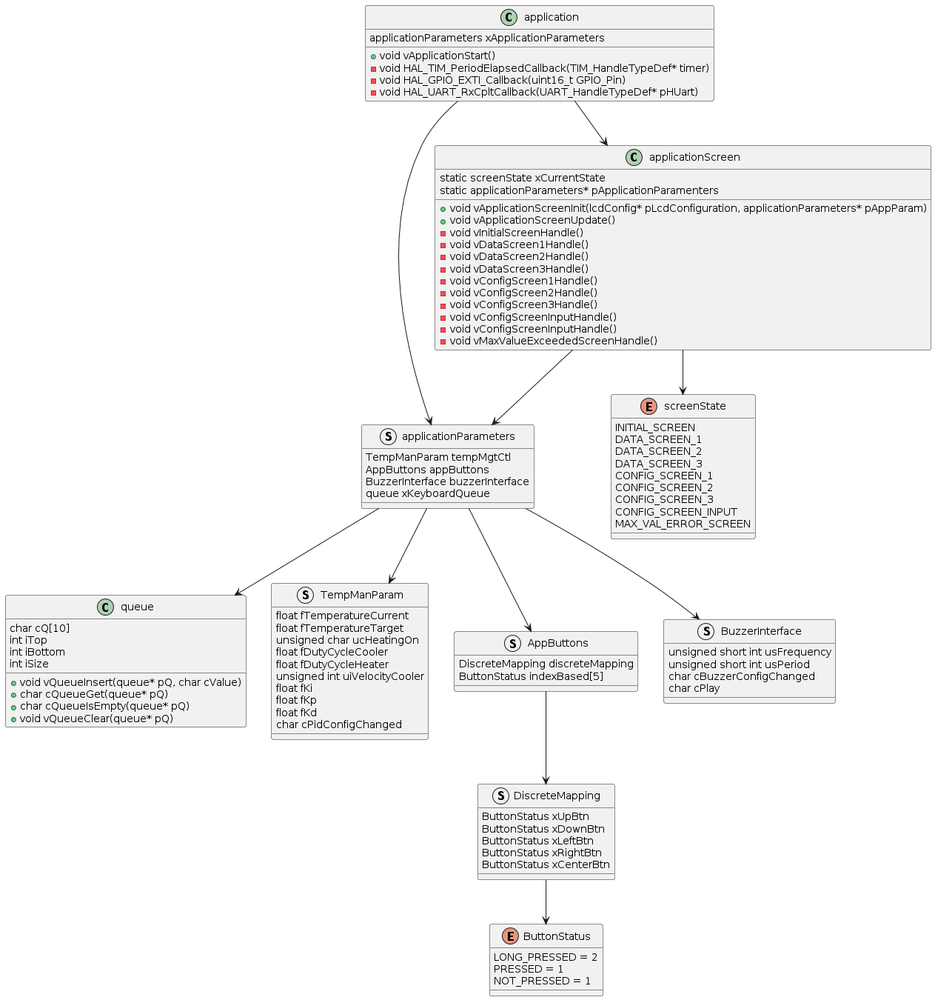

# ES670-2024-GrupoB3

## Project Overview

O projeto é composto por um sistema embarcado de tempo real para o controle de temperatura de um aquecedor. O sistema irá contar com diferentes formas de interação Homem / Máquina, além de 
diferentes protocolos de comunicação (UART, i2C, entre outros). 

A documentação do sistema está descrita no [relatório final](./ES670B_Projeto_Final.pdf).

## Modelagem do Sistema

De forma geral, os sistemas e subsistemas que irão compor o projeto são representados pelo diagrama de blocos abaixo:

Expandindo para o nível de arquitetura de software, temos a seguinte organização:

Aprofundando mais no quesito software e a relação de dependência entre cada módulo temos o seguinte diagrama UML parcial:
